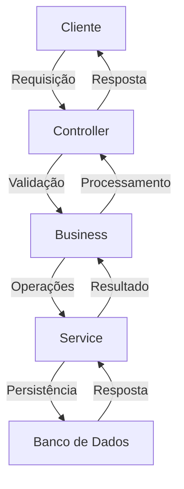

# Documentação do Sistema de Autenticação

Este documento descreve o fluxo completo de autenticação do sistema Auris, incluindo seus componentes, processos e considerações de segurança.

## 1. Estrutura de Autenticação

O sistema utiliza JWT (JSON Web Tokens) para gerenciar tokens de autenticação e implementa um padrão de arquitetura em camadas:
- Controller -> Business -> Service
- Middleware de autenticação para proteção de rotas

## 2. Componentes Principais

### 2.1 JwtService (`src/utils/auth/jwt.service.ts`)
- Implementa o padrão Singleton
- Gerencia operações com JWT (sign, verify, decode)
- Utiliza variáveis de ambiente para configuração:
  - JWT_SECRET: Chave secreta para assinatura dos tokens
  - JWT_EXPIRES_IN: Tempo de expiração dos tokens

### 2.2 HashService (`src/utils/auth/hash.service.ts`)
- Responsável pela criptografia de senhas
- Utiliza bcryptjs para hash seguro
- Implementa métodos para:
  - Hash de senhas
  - Comparação de senhas

### 2.3 AuthMiddleware (`src/middlewares/auth.middleware.ts`)
- Intercepta requisições para verificação de autenticação
- Valida tokens JWT
- Adiciona dados do usuário à requisição

## 3. Fluxo de Autenticação

### 3.1 Registro de Usuário
```
POST /auth/register
```
Processo:
1. Recebe dados do usuário (nome, email, senha, papel)
2. Verifica se o usuário já existe
3. Criptografa a senha
4. Cria o usuário no banco de dados
5. Cria registros específicos baseado no papel (terapeuta/paciente)

### 3.2 Login
```
POST /auth/login
```
Processo:
1. Recebe email e senha
2. Verifica credenciais
3. Gera token JWT
4. Para terapeutas, verifica status da assinatura
5. Retorna token e dados do usuário

### 3.3 Verificação de Token
```
GET /auth/verify-token
```
Processo:
1. Valida token JWT
2. Retorna status de validade e dados do usuário

## 4. Proteção de Rotas

- Todas as rotas protegidas utilizam o `authMiddleware`
- O middleware verifica o token no header `Authorization`
- Se válido, permite acesso à rota
- Se inválido, retorna erro 401

## 5. Segurança

### 5.1 Proteção de Dados
- Senhas são armazenadas com hash usando bcrypt
- Tokens JWT têm tempo de expiração configurável
- Implementa verificação de assinatura para terapeutas
- Utiliza variáveis de ambiente para chaves secretas

### 5.2 Integração com Stripe
- Para terapeutas, verifica status da assinatura no login
- Se assinatura inativa, retorna link para pagamento
- Implementa webhook para atualização de status de assinatura

## 6. Logging e Auditoria

### 6.1 Sistema de Logs
- Implementa logging de ações
- Registra operações de autenticação
- Mantém histórico de acessos

### 6.2 Tratamento de Erros
- Implementa tratamento de erros em todas as camadas
- Retorna mensagens de erro apropriadas
- Mantém logs de erros para auditoria

## 7. Considerações Técnicas

### 7.1 Dependências Principais
- jsonwebtoken: Para manipulação de JWT
- bcryptjs: Para criptografia de senhas
- express: Framework web
- mongoose: ODM para MongoDB

### 7.2 Variáveis de Ambiente Necessárias
```env
JWT_SECRET=sua_chave_secreta
JWT_EXPIRES_IN=1h
```

## 8. Boas Práticas Implementadas

1. **Segurança**
   - Uso de hash para senhas
   - Tokens com expiração
   - Proteção contra ataques comuns

2. **Organização**
   - Arquitetura em camadas
   - Separação de responsabilidades
   - Código modular e reutilizável

3. **Manutenibilidade**
   - Documentação clara
   - Logs detalhados
   - Tratamento de erros consistente

## 9. Fluxo de Dados



## 10. Exemplos de Uso

### 10.1 Registro de Usuário
```json
POST /auth/register
{
  "name_user": "Nome do Usuário",
  "email": "usuario@email.com",
  "password": "senha123",
  "role": "therapist",
  "crfa": "12345"
}
```

### 10.2 Login
```json
POST /auth/login
{
  "email": "usuario@email.com",
  "password": "senha123"
}
```

### 10.3 Verificação de Token
```http
GET /auth/verify-token
Authorization: Bearer seu_token_jwt
``` 